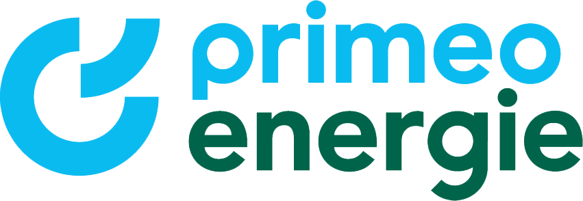
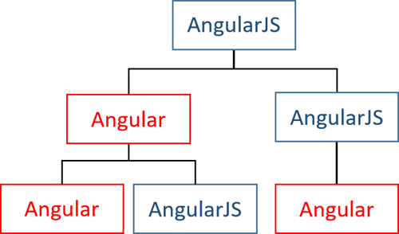
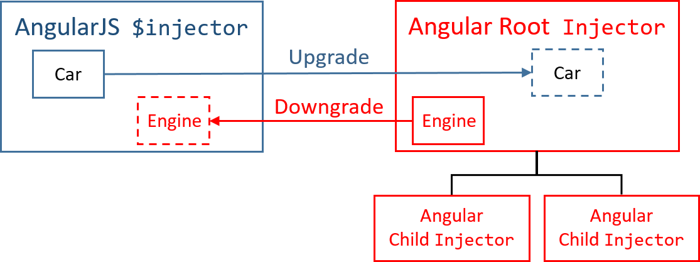

# ngUpgrade with an example

Fabian Küng, 11.09.2019

----

## Agenda

- Introduction
- ngUpgrade by an example
- ngUpgrade features
- Tools & alternatives
----

## About me
<!-- .slide: class="stretch about-me-slide" -->

- Development Consultant at inpeek
- Mainly frontend development
- Sometimes backend development (Java, SAP)
---

<!-- .slide: data-background="./assets/portal_edited.png" -->
<!-- .slide: class="about-project-slide" -->
## About the project

- Liferay portlets with AngularJS controller and template
- Migrate to Angular

Note:  
tell something about liferay  
- the main layout (navigation, etc.) is provided by liferay
- Routing handled by liferay
- liferay has the concept of portlets which are kind of a widget and can be drag and dropped on the page

----

# Implementation with UpgradeModule
----

## Bootstrapping the hybrid app
1. Angular is bootstrapped
2. AngularJS is bootstrapped
3. AngularJS owns root component
----

## Bootstrapping the hybrid app
Add UpgradeModule to imports, to get access to AngularJS core services
```typescript
imports: [BrowserModule, UpgradeModule]
```
Bootstrapping AngularJS application
```typescript
export class AppModule {
  constructor(private upgrade: UpgradeModule) {
  }
  ngDoBootstrap() {
    this.upgrade.bootstrap(
        document.body, 
        ['fuse'], 
        { strictDi: true }
    ); 
  }
}
```
----

## Mix and match components & directives

----

## Migrating our portlets to Angular
- Create a directive as a wrapper for template & controller
- Upgrading to Angular
```typescript
@Directive({
    selector: 'pe-legacy-portfolio'
})
export class LegacyPortfolioDirective extends UpgradeComponent {
    constructor(elementRef: ElementRef, injector: Injector) {
      super('legacyPortfolio', elementRef, injector);
    }
}
```

----

## Communication AngularJS & Angular
- With a service
- ViewChild
- Input / Outputs
- ...

----

## Communication example
AngularJS wrapper directive
```javascript
angular
  .module('app.legacyEvents', [])
  .directive('legacyEvents', function legacyEvents() {

    return {
      restrict: 'E',
      scope: {}, // empty scope is needed, otherwise angular-upgrade fails
      bindToController: {
        openParticipants: '&',
        selectedDate: '@'
      },
      template: '<div ng-include="\'assets/app/main/content/events/events.common.html\'"></div>',
      controller: 'EventsController',
      controllerAs: 'vm'
    };
  });
```
----

## Communication example

AngularJS Controller
```javascript
vm.openParticipants();
```

----

## Communication example

Upgrade to Angular
```typescript
@Directive({
  selector: 'pe-legacy-events'
})
export class LegacyEventsDirective extends UpgradeComponent {
  @Output() openParticipants: EventEmitter<void> = new EventEmitter();
  selectedDate: any;

  constructor(elementRef: ElementRef, injector: Injector) {
    super('legacyEvents', elementRef, injector);
  }
}
```

----

## Mix and match services

----

## Downgrading Angular injectables
```typescript
angular.module('app.downgraded').factory(
  'keycloakService', 
  downgradeInjectable(PecKeycloakService)
);
```

----

## Upgrading AngularJS services
Create service factory
```typescript
export function cookieInfoboxServiceFactory($injector) {
  return $injector.get('cookieInfoboxService');
}
```
Provide the service
```typescript
{
  provide: 'cookieInfoboxServiceInjectable',
  useFactory: cookieInfoboxServiceFactory,
  deps: ['$injector'] // $injector is provided by UpgradeModule
}
```

----

## Lazy migrating our codebase ❤️
- We mix and match Angular/AngularJS components/services to incrementally migrate our codebase
- Example (same page)
```html
<!-- new angular component -->
<pe-default-contact-information>
</pe-default-contact-information>
```
```html
<!-- legacy angularjs directive -->
<pe-legacy-contact-information>
</pe-legacy-contact-information>
```
---

# Additional ngUpgrade features
----

## Two possibilities
- either use `UpgradeModule` or the `downgradeModule()`
- `downgradeModule` does not bootstrap AngularJS inside Zone
- `downgradeModule` does not automatically run a `$digest()`
- allows better control about the change cycles
----
## Downgrading Angular components
```typescript
angular.module('heroApp', [])
  .component('heroDetail', heroDetail)
  .directive(
    'myContainer',
    downgradeComponent(
      {component: ContainerComponent}
    ) as angular.IDirectiveFactory
  );
```

----

## Upgrading router
- Ability to use AngularJS and Angular routing in parallel
- rather complex
- `@uirouter/angular-hybrid` could be used
----

## Caveats
- no use of module loader (i.e. browserify)
- no use of TypeScript in AngularJS
- global libraries
- minification (`staticDi: true`)

----

## Tools
- Nx Workspace (`ng generate upgrade-module/downgrade-module`)
- ngMigration Assistant
- ... any many more migration assistants
- ngMigration Forum

----

## Alternatives
- WebComponents (Angular Elements)
- Migrate the whole codebase at one
----

## Links
- [Upgrading from AngularJS to Angular (useful tips)](https://angular.io/guide/upgrade)
- [Angular UpgradeModule documentation](https://angular.io/api/upgrade/static/UpgradeModule)
- [Angular downgradeModule() documentation](https://angular.io/api/upgrade/static/downgradeModule)
- [Angular UpgradeModule examples](https://github.com/angular/angular/tree/f8096d499324cf0961f092944bbaedd05364eea1/aio/content/examples/upgrade-module)
- [NgUpgrade in Depth](https://blog.nrwl.io/ngupgrade-in-depth-436a52298a00)
